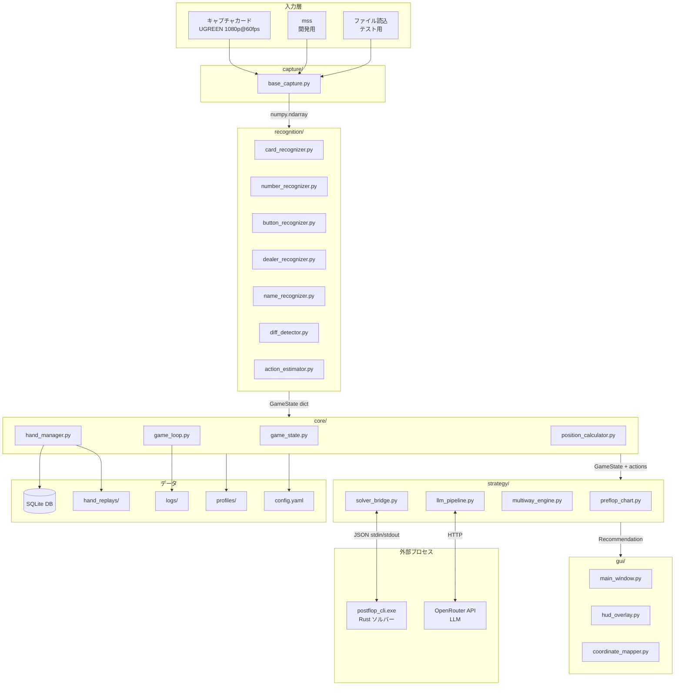
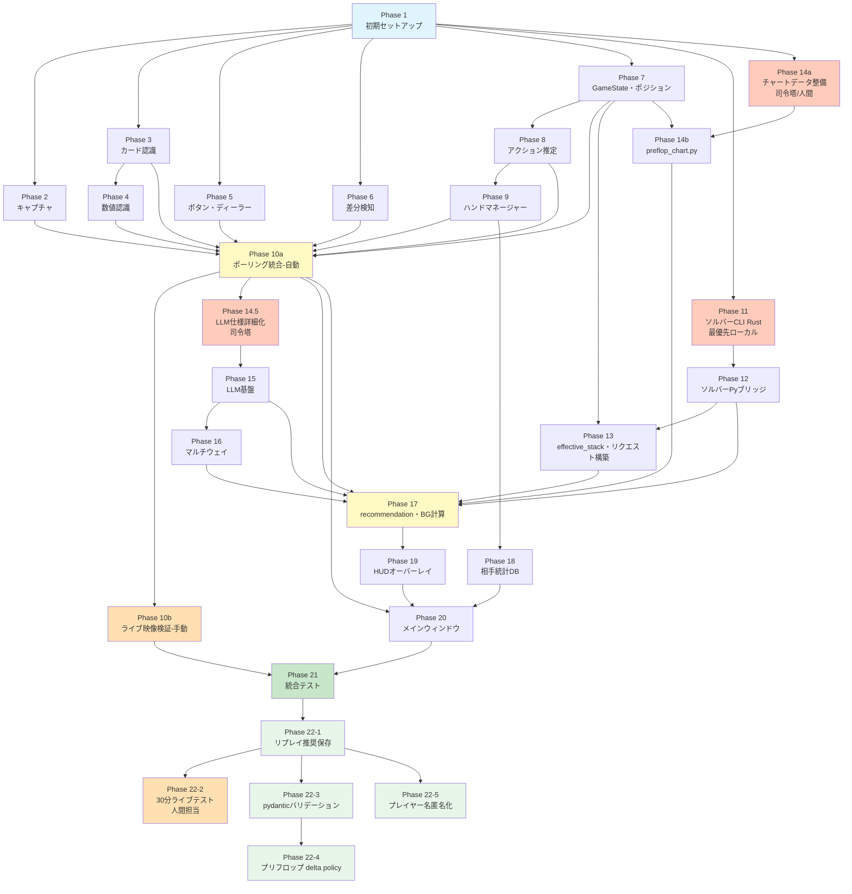

# ポーカーAIアシスタントシステム — 実装計画書（IMPLEMENTATION_PLAN.md）

**バージョン:** 1.3
**作成日:** 2026-05-02
**ベース仕様書:** SPEC.md v1.4


---

## 1. システム全体像

### 1.1 アーキテクチャ概要図



### 1.2 技術スタック

| 項目 | 選定内容 |
|------|----------|
| 言語 | Python 3.11.9 / Rust (ソルバーCLIのみ) |
| OCR | EasyOCR GPU (PyTorch 2.11.0+cu130) |
| 画像処理 | OpenCV, NumPy |
| GUI | PyQt6 |
| DB | SQLite3 (標準ライブラリ) |
| ソルバー | postflop-solver (Rust, AGPL-v3) |
| LLM | OpenRouter API |
| エクイティ | eval7 0.1.10 |
| 設定管理 | PyYAML + python-dotenv |
| テスト | pytest |
| GPU | NVIDIA RTX 3080 (CUDA 13.0) |

### 1.3 ディレクトリ構成

```
poker-assistant/
├── config.yaml
├── .env
├── .gitignore
├── AGENTS.md
├── README.md
├── requirements.txt
├── LICENSE-AGPL-v3
│
├── capture/
│   ├── __init__.py
│   ├── base_capture.py
│   ├── card_capture.py
│   ├── mss_capture.py
│   └── file_capture.py
│
├── recognition/
│   ├── __init__.py
│   ├── base_recognizer.py
│   ├── card_recognizer.py
│   ├── number_recognizer.py
│   ├── button_recognizer.py
│   ├── dealer_recognizer.py
│   ├── name_recognizer.py
│   ├── action_estimator.py
│   └── diff_detector.py
│
├── core/
│   ├── __init__.py
│   ├── game_state.py
│   ├── game_loop.py
│   ├── position_calculator.py
│   └── hand_manager.py
│
├── strategy/
│   ├── __init__.py
│   ├── preflop_chart.py
│   ├── solver_request_builder.py
│   ├── llm_pipeline.py
│   ├── multiway_engine.py
│   └── baseline_ranges.json
│
├── solver/
│   ├── postflop_cli/
│   │   ├── Cargo.toml
│   │   └── src/main.rs
│   ├── bin/
│   │   └── postflop_cli.exe
│   ├── solver_bridge.py
│   └── README.md
│
├── preflop_charts/
│   └── 6max_gto.json
│
├── gui/
│   ├── __init__.py
│   ├── main_window.py
│   ├── hud_overlay.py
│   └── coordinate_mapper.py
│
├── profiles/
│   ├── coinpoker_6max.json
│   └── ggpoker_6max.json
│
├── data/
│   └── poker_assistant.db
│
├── hand_replays/
│   └── YYYY-MM-DD/
│
├── logs/
│   └── poker_assistant.log
│
└── tests/
    ├── __init__.py
    ├── conftest.py
    ├── test_capture.py
    ├── test_card_recognizer.py
    ├── test_number_recognizer.py
    ├── test_button_recognizer.py
    ├── test_dealer_recognizer.py
    ├── test_diff_detector.py
    ├── test_action_estimator.py
    ├── test_game_state.py
    ├── test_position_calculator.py
    ├── test_hand_manager.py
    ├── test_solver_bridge.py
    ├── test_latency.py
    ├── fixtures/
    │   ├── ground_truth/
    │   │   └── coinpoker.json
    │   └── screenshots/
    │       ├── coinpoker/
    │       └── ggpoker/
    └── integration/
        └── live_test_procedure.md
```

---

## 2. 実装フェーズの分割

### Phase 1: プロジェクト初期セットアップ・基盤構築

- **目的**: リポジトリ作成、ディレクトリ構造、設定ファイル、共通ユーティリティ、テスト基盤を構築し、全Phaseの土台を作る
- **前提条件**: なし
- **成果物**:
  - `config.yaml` — 全設定項目のデフォルト値（SPEC.md セクション14.1準拠）
  - `.env.example` — .envのテンプレート
  - `.gitignore` — Python/Rust/IDE/データファイル除外
  - `AGENTS.md` — Codex向け開発ルール
  - `README.md` — プロジェクト概要
  - `requirements.txt` — 全Python依存パッケージ
  - `LICENSE-AGPL-v3` — ライセンスファイル
  - `profiles/coinpoker_6max.json` — PoC検証済み座標プロファイル
  - `profiles/ggpoker_6max.json` — GGPoker参考プロファイル
  - `tests/conftest.py` — pytest共通フィクスチャ（プロファイル読込、テスト画像パス等）
  - `tests/fixtures/ground_truth/coinpoker.json` — PoC正解データ（KNOWN_CARDS、数値、ボタン、ディーラー）
  - `tests/fixtures/screenshots/coinpoker/` — テスト画像14枚配置
  - 全ディレクトリの `__init__.py`
- **受け入れ基準**:
  - `pip install -r requirements.txt` がエラーなし
  - `pytest --collect-only` が全テストファイルを検出
  - `config.yaml` が PyYAML で正常にパース可能
  - 座標プロファイルが正常に読み込め、全キーが存在
- **推定タスク数**: 2〜3

---

### Phase 2: キャプチャ抽象化レイヤー

- **目的**: キャプチャカード/mss/ファイルの3方式を統一インターフェースで提供する
- **前提条件**: Phase 1 完了
- **成果物**:
  - `capture/__init__.py`
  - `capture/base_capture.py` — 抽象基底クラス（`get_frame() -> np.ndarray`）
  - `capture/card_capture.py` — OpenCV VideoCapture（SPEC.md セクション3.2準拠）
  - `capture/mss_capture.py` — mss画面キャプチャ
  - `capture/file_capture.py` — 静的画像ファイル読み込み（テスト用、ディレクトリ内を順次読込）
  - `tests/test_capture.py` — 各方式のユニットテスト
- **受け入れ基準**:
  - `file_capture` でテスト画像を読み込み、1920×1080 BGR numpy.ndarray が返る
  - `config.yaml` の `capture.method` 切替で正しいクラスがインスタンス化される
  - キャプチャカード未接続時に `card_capture` が適切な例外を返す
- **推定タスク数**: 2

---

### Phase 3: カード認識モジュール

- **目的**: 4色HSVスート判定 + EasyOCR GPUランク認識をモジュール化する
- **前提条件**: Phase 1 完了
- **成果物**:
  - `recognition/__init__.py` — EasyOCR Readerシングルトン管理
  - `recognition/base_recognizer.py` — 抽象基底クラス
  - `recognition/card_recognizer.py` — SPEC.md セクション4.3準拠（スート判定、ランクOCR、マージン、可視性判定、キャッシュ）
  - `tests/test_card_recognizer.py` — 14枚のテスト画像での精度テスト（目標: 通常画面100%）
- **受け入れ基準**:
  - cp_01〜cp_06の通常画面でカード認識100%（25/25カード正解）
  - cp_07/cp_08の特殊画面で可視性判定が正しくスキップを返す
  - EasyOCR Readerがシングルトンとして1インスタンスのみ生成される
- **推定タスク数**: 2〜3

---

### Phase 4: 数値認識モジュール

- **目的**: ポット/スタック/ベット額のOCR認識をモジュール化する
- **前提条件**: Phase 1 完了、Phase 3（EasyOCRシングルトン共有のため）
- **成果物**:
  - `recognition/number_recognizer.py` — SPEC.md セクション4.4準拠（ポットHSV色フィルタ、OTSU二値化、スタック/ベットクリーニング）
  - `tests/test_number_recognizer.py` — 14枚のテスト画像での精度テスト（目標: 104/104=100%）
- **受け入れ基準**:
  - 全14枚のテスト画像で数値認識テストPASS（値あり47/47、空57/57）
  - ポット表示の「ポット」ラベルがフィルタされ数字のみ抽出される
  - 空領域が正しくNoneを返す
- **推定タスク数**: 2

---

### Phase 5: ボタン・ディーラー認識モジュール

- **目的**: 自分ターン判定、ボタン種別分類、ディーラーボタン座席検出をモジュール化する
- **前提条件**: Phase 1 完了
- **成果物**:
  - `recognition/button_recognizer.py` — SPEC.md セクション4.5準拠（HSV色検出、文脈判定）
  - `recognition/dealer_recognizer.py` — SPEC.md セクション4.6準拠（赤+白ピクセルスコアリング）
  - `tests/test_button_recognizer.py` — 自分ターン判定8/8、ボタン種別9/9テスト
  - `tests/test_dealer_recognizer.py` — 通常画面6/6テスト
- **受け入れ基準**:
  - 自分ターン検出: 8/8 = 100%
  - ボタン種別: 9/9 = 100%（cp_04のcheck/bet正解データ含む）
  - ディーラーボタン: 通常画面6/6 = 100%
- **推定タスク数**: 2

---

### Phase 6: 差分検知モジュール

- **目的**: フレーム間差分検知によるOCRスキップ最適化を実装する
- **前提条件**: Phase 1 完了
- **成果物**:
  - `recognition/diff_detector.py` — SPEC.md セクション4.10準拠（領域別閾値、差分計算）
  - `tests/test_diff_detector.py` — 差分あり/なしの判定テスト
- **受け入れ基準**:
  - 同一画像の連続入力で全領域「変化なし」を返す
  - 異なる画像入力で変化のあった領域のみ「変化あり」を返す
  - config.yamlの閾値パラメータが正しく読み込まれる
- **推定タスク数**: 1〜2

---

### Phase 7: GameState構造体 + ポジション計算

- **目的**: GameState dataclass/dictの定義とポジション自動算出ロジックを実装する
- **前提条件**: Phase 1 完了
- **成果物**:
  - `core/__init__.py`
  - `core/game_state.py` — SPEC.md セクション19準拠（全フィールド定義、is_seated/in_current_hand分離、**GameState差分ユーティリティ**: 前後フレームの数値変化抽出関数 `compute_state_diff(prev, curr)` を含む）
  - `core/position_calculator.py` — SPEC.md セクション4.8準拠
  - `tests/test_game_state.py` — GameState生成・シリアライズ・差分計算テスト
  - `tests/test_position_calculator.py` — 2〜6人のポジション割り当てテスト

- **受け入れ基準**:
  - GameStateが全フィールドを保持しJSON変換可能
  - 2〜6人全パターンでポジションが正しく割り当てられる
  - ヘッズアップでBTN=SBが正しく処理される
  - ディーラーボタン未検出時のフォールバックが動作
- **推定タスク数**: 2

---

### Phase 8: アクション推定モジュール

- **目的**: 前後フレームのGameState差分からアクションを推定するロジックを実装する
- **前提条件**: Phase 7 完了
- **成果物**:
  - `recognition/action_estimator.py` — SPEC.md セクション4.7準拠
  - `tests/test_action_estimator.py` — 各アクションタイプの検出テスト
  - `tests/fixtures/action_sequences/` — PoC v2の167フレーム自動キャプチャから抽出したGameStateシーケンス（JSON形式）。各アクションタイプ（FOLD/CHECK/CALL/BET/RAISE/ALL_IN/NEW_HAND/NEW_STREET/BETS_COLLECTED）のサンプルを含む

- **受け入れ基準**:
  - `tests/fixtures/action_sequences/` の実データGameStateシーケンスに対して、全アクションタイプが正しく検出される
  - NEW_HAND/NEW_STREET/BETS_COLLECTEDが正しく検出される
  - OCR失敗1-2フレームでFOLDを出さず、3フレーム連続Noneで初めてFOLDを出す
  - ポット急変が1フレームで無視され、2フレーム連続で採用される

- **推定タスク数**: 3

---

### Phase 9: ハンドマネージャー

- **目的**: ハンドのライフサイクル管理、アクション履歴蓄積、ヒーローアクション記録、DB/リプレイ保存を実装する
- **前提条件**: Phase 7, Phase 8 完了
- **成果物**:
  - `core/hand_manager.py` — SPEC.md セクション4.11〜4.15準拠（ターン境界保存、2段階遷移、重複排除、NEW_HAND初期化、ブラインド記録）
  - `tests/test_hand_manager.py` — ハンドライフサイクルの統合テスト
- **受け入れ基準**:
  - ホールカード出現→preflop→flop→turn→river→hand_end→waitingの完全な遷移が動作
  - ヒーローのFOLD/CHECK/CALL/BET/RAISE/ALL_INが正しく記録される
  - hand_end遷移条件の3パターンが全て動作:
    - ヒーローのホールカード5フレーム連続消失
    - ヒーローのFOLDアクション検出（カード消失3フレームで確定）
    - ショーダウン完了（board_card_count=5が10フレーム以上継続＋ポット値変化なし）
  - hand_end→waiting遷移がNEW_HAND検出または10秒タイムアウトで正常動作
  - 重複排除が同一アクション（同一seat/action/amount±5%）の連続検出を正しく排除
  - NEW_HAND後のブラインド記録（BLIND_SB/BLIND_BB）が正しく動作
  - リプレイJSONがSPEC.md セクション11.2のスキーマで生成される
  - DB初期化（CREATE TABLE IF NOT EXISTS）がhand_manager起動時に実行される
- **推定タスク数**: 3〜4

---

### Phase 10a: ポーリングループ統合（自動テスト）

- **目的**: 全認識モジュールを結合し、静的画像連続再生によるハンドライフサイクルの自動検証を行う
- **前提条件**: Phase 2〜9 全て完了
- **成果物**:
  - `core/game_loop.py` — SPEC.md セクション3.3, 22, 23準拠（ポーリングループ、QThread対応準備、ログ出力）
  - `recognition/name_recognizer.py` — プレイヤー名OCR
  - `tests/test_latency.py` — Level 1全テスト統合
- **受け入れ基準**:
  - Level 1テスト: カード認識100%、数値認識95%以上、ボタン検出100%
  - file_captureで167枚自動キャプチャを連続入力し、GameState JSONが全フェーズで安定
  - アクション推定が全タイプを正常検出
  - 差分検知のスキップ率60%以上
- **推定タスク数**: 3

### Phase 10b: ライブ映像検証（手動）

- **目的**: キャプチャカード経由のPractice Games映像で動作を手動検証する
- **前提条件**: Phase 10a 完了
- **成果物**:
  - `tests/integration/live_test_procedure.md` — Level 2テスト手順書
  - 差分閾値のチューニング結果（config.yaml更新）
- **受け入れ基準**:
  - ハンド境界（開始/終了）が10ハンド連続で正確に検出
  - 30分間のライブ映像でフォールバック発動率 < 5%
- **推定タスク数**: 1〜2（人間担当）

---

### Phase 11: ソルバーCLIラッパー（Rust）

- **目的**: postflop-solverのRust CLI常駐ラッパーを実装・ビルドする
- **前提条件**: Phase 1 完了
- **成果物**:
  - `solver/postflop_cli/Cargo.toml`
  - `solver/postflop_cli/src/main.rs` — SPEC.md セクション5.4〜5.9準拠（stdin JSON行読込→solve→stdout JSON行出力、常駐ループ、タイムアウト部分結果）
  - `solver/bin/postflop_cli.exe` — ビルド済みバイナリ
  - `solver/README.md` — ビルド手順、JSON入出力仕様
- **受け入れ基準**:
  - CLIプロセスが起動し、stderrに "ready" を出力
  - JSON入力に対してJSON出力を返す
  - フロップsolveが7秒以内に完了
  - タイムアウト時に部分結果（exploitability + strategy）を返す
- **推定タスク数**: 3〜4
- **注意**: このPhaseはローカル環境で実施。Codexは担当しない
- **実施タイミング**: Phase 1完了直後に最優先で開始する。ローカル作業のため、Phase 2〜9のCodex作業と完全に並列実行可能。Phase 12以降がブロックされないよう、Phase 10a完了までにバイナリをコミットすることを目標とする
- **注意**: Codex対象外。ローカル環境でRustビルドを行い、バイナリをリポジトリにコミットする

---

### Phase 12: ソルバーPythonブリッジ

- **目的**: Rust CLIラッパーとのJSON通信を行うPythonブリッジを実装する
- **前提条件**: Phase 1 完了、Phase 11（バイナリが必要）
- **成果物**:
  - `solver/solver_bridge.py` — SPEC.md セクション5.10準拠（PostflopSolverBridge、start/solve/stop/cancel、ヘルスチェック）
  - `tests/test_solver_bridge.py` — 起動・solve・停止・タイムアウト・ヘルスチェックテスト
- **受け入れ基準**:
  - start()でCLIプロセスが起動しready確認
  - solve()がJSON送受信し正常なレスポンスを返す
  - stop()でプロセスが正常終了
  - プロセス死亡時のヘルスチェック→自動再起動が動作
  - 3回連続再起動失敗でソルバー無効化
- **推定タスク数**: 2

---

### Phase 13: effective_stack計算 + ソルバーリクエスト構築

- **目的**: GameStateからソルバーリクエストJSONを構築するロジックを実装する
- **前提条件**: Phase 7, Phase 12 完了
- **成果物**:
  - `strategy/__init__.py`
  - `strategy/solver_request_builder.py` — effective_stack計算（SPEC.md セクション5.12）、GameState→ソルバーJSON変換、ベットサイズ動的切替
  - テスト
- **受け入れ基準**:
  - ヘッズアップ時のeffective_stackが正しく計算される
  - マルチウェイ（3人以上）でuse_solver=Falseが返される
  - ベットサイズ動的切替（残秒数ベース）が正しく動作
  - 構築されたJSONが SPEC.md セクション5.8のスキーマに準拠
- **推定タスク数**: 2

**注記**: `strategy/solver_request_builder.py` はSPEC.md セクション13のディレクトリ構成に未記載。SPEC.md v1.4で追記する。

---

### Phase 14a: プリフロップチャートデータ整備

- **目的**: GTO公開チャートからプリフロップチャートJSONデータを作成する
- **前提条件**: Phase 1 完了
- **成果物**:
  - `preflop_charts/6max_gto.json` — 6ポジション × 主要アクションパターン（RFI、vs raise 3bet/call/fold）のレンジデータ
- **受け入れ基準**:
  - 全6ポジションのRFIレンジが定義されている
  - BB vs raiseの3bet/call/foldレンジが定義されている
  - レンジ文字列がPioSOLVER互換形式（SPEC.md セクション5.6）に準拠
- **推定タスク数**: 1（司令塔AIまたは人間が担当。Codex対象外）

### Phase 14b: プリフロップチャート参照ロジック

- **目的**: チャートJSONを読み込み、ポジション×アクション履歴から推奨アクションを返すロジックを実装する
- **前提条件**: Phase 7 完了、Phase 14a 完了
- **成果物**:
  - `strategy/preflop_chart.py` — SPEC.md セクション7準拠
  - テスト
- **受け入れ基準**:
  - 全6ポジションのRFIレンジが参照可能
  - BB vs raise（3bet/call/fold）が参照可能
  - 不明なアクションパターンでフォールバック（fold推奨）を返す
- **推定タスク数**: 2

---

### Phase 14.5: LLM仕様詳細化（司令塔AI担当）

- **目的**: SPEC.md 付録D「Phase 3直前に詳細化」の項目を確定する
- **前提条件**: Phase 10a 完了（GameStateの実データが得られた後）
- **成果物**:
  - LLMプロンプトテンプレート（4タスク分: レンジ推定、搾取調整、マルチウェイ判断、判断理由）
  - LLM出力JSON Schema（各タスクの期待出力形式）
  - トークン上限の目安
  - モデル切替条件の具体的定義（「重要局面」= SPR < 3 or pot > 50BB or all-in判定等）
- **受け入れ基準**:
  - 4タスクのプロンプトテンプレートが完成
  - 各出力JSON Schemaが定義され、バリデーション可能
- **推定タスク数**: 2（司令塔AIが担当。Codex対象外）

---

### Phase 15: LLMパイプライン基盤

- **目的**: OpenRouter APIとの通信、レンジ推定、搾取調整、判断理由生成の基盤を実装する
- **前提条件**: Phase 1 完了、**Phase 14.5 完了**
- **成果物**:
  - `strategy/llm_pipeline.py` — SPEC.md セクション6.1〜6.4準拠（4タスク、タイムアウト、リトライ、フォールバック）
  - `strategy/baseline_ranges.json` — ベースラインレンジテーブル（主要ポジション×アクション）
  - テスト（APIモック使用）
- **受け入れ基準**:
  - APIモックでレンジ推定がPioSOLVER互換形式（SPEC.md セクション5.6準拠）の Range 文字列を返す
  - Range文字列のバリデーション（カンマ区切り、ハンド表記、プラス表記、ダッシュ範囲）が正常動作
  - API失敗時にbaseline_ranges.jsonへフォールバック
  - タイムアウト（2秒）が正しく動作
  - リトライ1回が実行される
  - Phase 14.5で作成されたプロンプトテンプレートとJSON Schemaが適用されている
- **推定タスク数**: 3


---

### Phase 16: マルチウェイエンジン

- **目的**: eval7 MCエクイティ計算 + LLM主導のマルチウェイ判断を実装する
- **前提条件**: Phase 15 完了
- **成果物**:
  - `strategy/multiway_engine.py` — SPEC.md セクション6.3準拠（eval7呼び出し、LLMへのエクイティ＋統計提示、最適アクション生成）
  - テスト
- **受け入れ基準**:
  - eval7で3〜6人のMCエクイティが20ms以内に算出される
  - LLM（モック）にエクイティ＋ボード情報を提示し推奨アクションを受信
  - 保守的バイアスが反映される（同エクイティならチェック/フォールド寄り）
- **推定タスク数**: 2

---

### Phase 17: recommendation生成 + バックグラウンド計算

- **目的**: ストリート確定時のバックグラウンド先行計算、ターン到来時の結果表示、ストリート跨ぎ時の破棄ロジックを実装する
- **前提条件**: Phase 10a, Phase 12, Phase 13, Phase 14b, Phase 15, Phase 16 完了
- **成果物**:
  - `core/game_loop.py` への統合（バックグラウンド計算トリガー追加）
  - recommendation生成フロー（SPEC.md セクション6.5準拠）
  - **先行計算結果は `core/game_loop.py` の内部状態として保持する**（`_pending_recommendation` 属性。ストリート変更時にクリア）
  - テスト

- **受け入れ基準**:
  - NEW_STREET検出時にバックグラウンドでソルバー/LLM計算が開始される
  - is_my_turn=True時に先行計算結果が即座に利用可能
  - ストリート跨ぎ時に進行中のソルバー結果が破棄される
  - 先行計算未完了時に「計算中...」が返される
  - プリフロップではチャート参照のみ（ソルバー不使用）
- **推定タスク数**: 3

---

### Phase 18: 相手統計DB

- **目的**: SQLite DBの作成、ハンド終了時の統計更新、鮮度管理を実装する
- **前提条件**: Phase 9 完了
- **成果物**:
  - **DB初期化は `core/hand_manager.py` に統合**（hand_manager起動時に `CREATE TABLE IF NOT EXISTS` を実行する形式。別ファイル不要）
  - `core/hand_manager.py` へのDB保存ロジック追加
  - プレイヤー名照合（前方一致 `LIKE 'xxx%'`）の実装
  - テスト

- **受け入れ基準**:
  - opponents / hand_history テーブルが正常に作成される
  - ハンド終了時にDB保存が成功
  - 統計（VPIP, PFR等）がハンド終了時に更新される
  - 90日以上未対戦のプレイヤーにfreshness_noteが付与される
  - プレイヤー名の前方一致照合が正しく動作
- **推定タスク数**: 2〜3

---

### Phase 19: HUDオーバーレイ

- **目的**: PyQt6透過ウィンドウによる推奨アクション表示を実装する
- **前提条件**: Phase 17 完了
- **成果物**:
  - `gui/__init__.py`
  - `gui/hud_overlay.py` — SPEC.md セクション9.2準拠（透過ウィンドウ、推奨アクション、確率分布、理由、統計、信頼度、ドラッグ、ホットキー）
  - テスト（手動確認）
- **受け入れ基準**:
  - HUDがCoinPokerウィンドウの外側に表示される
  - 推奨アクション（FOLD/CALL/RAISE + サイズ）が表示される
  - ホットキーで表示/非表示が切り替わる
  - ドラッグで位置調整が可能
- **推定タスク数**: 2〜3

---

### Phase 20: メインウィンドウ

- **目的**: PyQt6のタブ形式メインウィンドウ（設定/稼働/統計）を実装する
- **前提条件**: Phase 10a, Phase 18, Phase 19 完了
- **成果物**:
  - `gui/main_window.py` — SPEC.md セクション9.1準拠（設定タブ、稼働タブ、統計タブ）
  - `gui/coordinate_mapper.py` — Snipping風オーバーレイ（座標マッピング）
  - **`main.py`**（プロジェクトルート。`python main.py` で起動）— SPEC.md セクション23準拠
  - `tests/test_gui_smoke.py` — pytest-qtによる起動・ウィジェット存在確認スモークテスト
- **受け入れ基準**:
  - pytest-qtスモークテスト: アプリ起動→3タブ存在→正常終了
  - START/STOPでポーリングループが開始/停止
  - リロードボタンで座標プロファイル＋config.yaml（recognition/action_estimation/gameセクション）再読み込み
  - 手動視覚確認: 稼働タブにGameState JSON表示、統計タブに対戦相手一覧表示
- **推定タスク数**: 4〜5


---

### Phase 21: 統合テスト・チューニング

- **目的**: 全モジュールを結合した状態でLevel 2/Level 3テストを実施し、Phase 6完了基準を達成する
- **前提条件**: Phase 10a, Phase 10b, Phase 11〜20 全て完了
- **成果物**:
  - `tests/integration/live_test_procedure.md` — 更新版Level 2テスト手順書
  - `tests/test_latency.py` — 更新版（全パイプライン計測）
  - 調整済みのconfig.yaml（Phase 10bのチューニング結果を引き継ぎ、全パイプライン統合後に最終調整した値）
- **受け入れ基準（= SPEC.md Phase 6完了基準）**:
  - Level 2テスト: 30分間で認識エラー0件
  - Level 3テスト: E2Eレイテンシ P95 ≤ 7秒
  - 回帰テスト（Level 1）が全項目PASS
- **推定タスク数**: 3〜4

---
---

### Phase 22-1: リプレイJSONへの推奨・レイテンシ保存

- **目的**: game_loop.py から hand_manager への推奨データ受け渡しを実装し、リプレイJSONに recommendation, human_action, time_to_recommend_ms, latency_breakdown を保存する
- **前提条件**: Phase 21 完了
- **成果物**:
  - `core/game_loop.py` — 推奨生成時に hand_manager.set_recommendation() を呼び出すロジック追加
  - `core/hand_manager.py` — set_recommendation() が現在のストリートの StreetActions に推奨データを格納する実装（メソッドは既に存在するが、game_loop から呼ばれていない）
  - `core/game_loop.py` — レイテンシ計測（time.perf_counter）の追加。generate() 呼び出し前後で計測し、latency_breakdown を構築
  - テスト
- **受け入れ基準**:
  - Practice Games で5ハンド以上プレイし、リプレイJSONに recommendation フィールドが保存されている
  - time_to_recommend_ms が合理的な値（100〜10000ms）
  - latency_breakdown に capture_ms, ocr_ms, llm_ms, solver_ms が含まれる
  - human_action が CHECK/FOLD/CALL/BET/RAISE のいずれかで記録される
  - 既存テスト（538件）が全PASS
- **推定タスク数**: 2〜3

---

### Phase 22-2: 30分ライブテスト + ベースライン計測

- **目的**: Phase 22-1 の推奨保存機能を使い、30分間のPractice Gamesで推奨精度のベースラインデータを蓄積する
- **前提条件**: Phase 22-1 完了
- **成果物**:
  - `tests/integration/live_test_procedure.md` — 更新版（推奨保存の確認手順追加）
  - 30分間のリプレイJSONデータ（hand_replays/に蓄積）
  - ベースライン計測レポート（手動作成）:
    - 総ハンド数
    - 推奨が保存されたハンド数 / 総ハンド数
    - followed_recommendation の割合
    - strategy_source の分布（chart / solver / llm / multiway / fallback）
    - time_to_recommend_ms の p50, p95
    - フォールバック発動率
    - 認識エラー発生数
- **受け入れ基準**:
  - 30分間連続稼働で認識エラー0件
  - 推奨保存率 > 80%（is_my_turn=True のストリートの80%以上で推奨が記録）
  - E2Eレイテンシ P95 ≤ 7秒
- **推定タスク数**: 1〜2（人間担当）
- **注意**: Codex対象外。人間がPractice Gamesをプレイしてデータ収集

---

### Phase 22-3: strict JSON schema / pydanticバリデーション

- **目的**: LLMパイプラインの全タスクにpydanticモデルによるstrict バリデーションを導入する
- **前提条件**: Phase 22-1 完了
- **成果物**:
  - `strategy/llm_schemas.py` — pydantic BaseModel 定義:
    - RangeEstimationRequest / RangeEstimationResponse
    - ExploitAdjustmentRequest / ExploitAdjustmentResponse
    - MultiwayDecisionRequest / MultiwayDecisionResponse
    - ReasonGenerationRequest / ReasonGenerationResponse
  - `strategy/llm_pipeline.py` — 各タスクでpydanticバリデーションを適用
  - `requirements.txt` — pydantic 追加
  - `tests/test_llm_schemas.py` — スキーマバリデーションテスト
- **受け入れ基準**:
  - 全4タスクのRequest/Responseモデルが定義されている
  - 正常なLLM応答がバリデーションをPASS
  - 不正な応答（欠損キー、型不一致）がValidationErrorを発生させる
  - ValidationError発生時にベースラインへフォールバック
  - バリデーション成功率がログに記録される
  - 既存テストが全PASS
- **推定タスク数**: 2〜3

---

### Phase 22-4: プリフロップ delta policy 導入

- **目的**: SPEC.md セクション7.1に基づき、プリフロップにおけるLLM介入（chart-anchored delta policy）を実装する
- **前提条件**: Phase 22-3 完了
- **成果物**:
  - `strategy/preflop_delta_policy.py` — SPEC.md セクション7.1準拠:
    - 入力: hero_position, hero_hand, chart_anchor_probs, villain_stats
    - 出力: delta_probs, confidence, reason
    - 介入条件（サンプル数閾値）の判定
    - shift capの適用
    - バリデーション（合計0、範囲チェック、禁止アクションチェック）
  - `strategy/llm_schemas.py` — PreflopDeltaRequest / PreflopDeltaResponse 追加
  - `strategy/recommendation_engine.py` — プリフロップ生成パスに delta policy を統合
  - `config.yaml` — preflop_delta セクション追加（shift_cap, sample_thresholds, timeout_ms）
  - `tests/test_preflop_delta_policy.py`
- **受け入れ基準**:
  - pure node（チャート確率0のアクション）にdeltaが割り当てられない
  - delta_probs の合計が0（±0.01）
  - chart_anchor_probs + delta_probs の各値が 0.0〜1.0
  - サンプル数 < 30 の場合にチャートのみが返される
  - タイムアウト（1000ms）時にチャートのみにフォールバック
  - 既存テストが全PASS
- **推定タスク数**: 3〜4

---

### Phase 22-5: プレイヤー名匿名化

- **目的**: SPEC.md セクション15.3に基づき、LLM APIへのプレイヤー名送信を防止する
- **前提条件**: Phase 22-1 完了
- **成果物**:
  - `strategy/llm_pipeline.py` — プレイヤー名を座席番号に置換するロジック追加
  - `strategy/multiway_engine.py` — 同上
  - テスト
- **受け入れ基準**:
  - LLM APIリクエストのJSONにプレイヤー名が含まれないこと（"seat_2", "seat_3" 等で置換）
  - 統計データのLLMへの提示にプレイヤー名が含まれないこと
  - DB保存とローカルログにはプレイヤー名がそのまま記録されること
  - 既存テストが全PASS
- **推定タスク数**: 1〜2


## 3. 依存関係マップ



**凡例:**
- 水色: 基盤
- 黄色: 統合ポイント（Codex）
- オレンジ薄: 手動検証
- 緑: 最終検証
- オレンジ: ローカル/司令塔作業（Codex対象外）
- 薄緑: Phase 22 品質向上（v1.3で追加）

**並列実行可能なグループ:**
- Phase 1 完了後: Phase 2, 3, 5, 6, 7, 11, 14a は並列着手可能
- Phase 7 完了後: Phase 8, 13, 14b は並列着手可能
- Phase 10a（画面認識統合）と Phase 12〜16（戦略判断）は独立して進行可能
- Phase 10a 完了後: Phase 14.5 を開始し、完了次第 Phase 15 に着手
- Phase 22-1 完了後: Phase 22-3 と Phase 22-5 は並列着手可能
- Phase 22-2 は人間担当のため、Phase 22-3/22-5 のCodex作業と並列実行可能

---

## 4. リスク・注意事項

### 4.1 技術的に難易度の高い箇所

| 箇所 | 難易度 | 理由 | 対策 |
|------|--------|------|------|
| Phase 9: ハンドマネージャー | 高 | 状態遷移の組合せが多い（6フェーズ × 複数遷移条件）。ターン境界保存、重複排除、ブラインド記録等の細かいロジックが絡む | ユニットテストを網羅的に作成。各遷移条件を独立テストしてから統合 |
| Phase 10a: ポーリングループ統合（自動テスト） | 高 | 全認識モジュールを結合する最初のタイミング。座標プロファイルの微調整が発生する可能性 | テスト画像での回帰テストを先に全PASS確認してからPhase 10bのライブ映像に移行 |
| Phase 17: バックグラウンド計算 | 高 | QThreadとソルバープロセスの非同期連携、ストリート跨ぎ時の結果破棄、先行計算タイミング制御 | まず同期実行で動作確認→その後バックグラウンド化。破棄ロジックは状態フラグで管理 |
| Phase 11: Rust CLIラッパー | 中〜高 | Rust実装。ただしpostflop-solverのAPI精読は完了済み | ローカル作業。examples/のサンプルコードを先に実行して入出力を確認 |
| Phase 22-4: delta policy | 中 | LLM出力のバリデーションと既存チャートロジックとの統合。shift capの適用タイミング | Phase 22-3のpydanticスキーマを先に完成させ、バリデーション基盤の上に構築する |


### 4.2 仕様が曖昧で確認が必要な箇所

| 箇所 | 曖昧な点 | Phase | 推奨対応 |
|------|---------|-------|---------|
| 差分検知閾値 | ピクセル差分合計の絶対値が領域サイズに依存する | Phase 6 | Phase 6実装時に実際のクロップ領域で計測し、必要に応じて正規化方式に変更 |
| プレイヤー名OCR | 日本語/英語/数字混在の名前のOCR精度が未検証 | Phase 10a | Phase 10aでname_recognizer実装時にテスト。低精度なら座席番号のみで追跡 |
| プリフロップチャートのデータソース | 具体的なチャートデータの出典が未決定 | Phase 14a | Phase 14a着手前にGTO Wizard等からデータを取得。初期は主要パターンのみで開始 |
| eval7のマルチウェイ人数制限 | 5〜6人同時計算のサンプル数妥当性が未検証 | Phase 16 | Phase 16実装時に3/4/5/6人で実測し、サンプル数を調整 |

### 4.3 フェーズ間で整合性に注意が必要な箇所

| フェーズ間 | 注意点 |
|-----------|--------|
| Phase 3 ↔ Phase 4 | EasyOCR Readerシングルトンの共有。recognition/__init__.py での初期化タイミングを統一 |
| Phase 7 ↔ Phase 8 ↔ Phase 9 | GameStateの is_seated / in_current_hand の使い分け。Phase 7で型定義→Phase 8で参照→Phase 9で更新。型定義の変更はPhase 7で行い、下流Phaseに波及させない |
| Phase 8 ↔ Phase 9 | action_estimatorの出力をhand_managerが受け取る。出力スキーマ（actions配列の構造）を Phase 8 と Phase 9 で一致させる |
| Phase 10 ↔ Phase 17 | game_loop.pyは Phase 10 で基本実装、Phase 17 でバックグラウンド計算を追加する。Phase 10 の時点でソルバー/LLM呼び出しのフックポイントを設計しておく |
| Phase 12 ↔ Phase 13 | solver_bridge.pyの solve() メソッドのインターフェースを Phase 12 で確定し、Phase 13 のリクエスト構築がそれに準拠 |
| Phase 18 ↔ Phase 20 | DB スキーマと統計タブUIのカラム名を一致させる |

### 4.4 ローカル作業が必要なPhase

Phase 11（Rust CLIラッパー）、Phase 14a（チャートデータ整備）、Phase 14.5（LLM仕様詳細化）はCodex対象外。

Phase 11はPhase 1完了直後に最優先で開始し、Phase 2〜9のCodex作業と並列実行する。Phase 10a完了までにバイナリをコミットすることを目標とする。クリティカルパス（Phase 12 → 13 → 17）を遅延させないため最優先扱いとする。

Phase 14aは司令塔AIまたは人間がGTO公開チャートからデータを作成する。Phase 14bはこのデータの存在を前提とする。

Phase 14.5は司令塔AIがPhase 10a完了後にGameStateの実データを参照しながらLLMプロンプトテンプレートとJSON Schemaを作成する。Phase 15はこの成果物を前提とする。

Phase 1で配置するAGENTS.mdは、司令塔AIがPhase 1着手前に作成する。


### 4.5 テスト戦略のまとめ

| テストレベル | 実施Phase | 内容 |
|------------|----------|------|
| ユニットテスト | Phase 2〜9, 12〜16 | 各モジュール単体のpytestテスト |
| 統合テスト（Level 1） | Phase 10a | 全認識モジュール + テスト画像 |
| ライブ映像テスト（Level 2） | Phase 10b, 21 | キャプチャカード経由30分連続 |
| E2Eレイテンシテスト（Level 3） | Phase 21 | 全パイプラインP95≤7秒 |
| 回帰テスト | 全Phase | 新機能追加時にLevel 1を自動実行 |
| ベースライン計測 | Phase 22-2 | 30分Practice Games、推奨保存率・レイテンシ・ソース分布の計測 |
| スキーマバリデーションテスト | Phase 22-3 | 全LLMタスクのpydanticモデル正常/異常テスト |
| delta policy テスト | Phase 22-4 | pure node保護、shift cap、タイムアウトフォールバック |


---

**IMPLEMENTATION_PLAN.md 終了**
```

---
